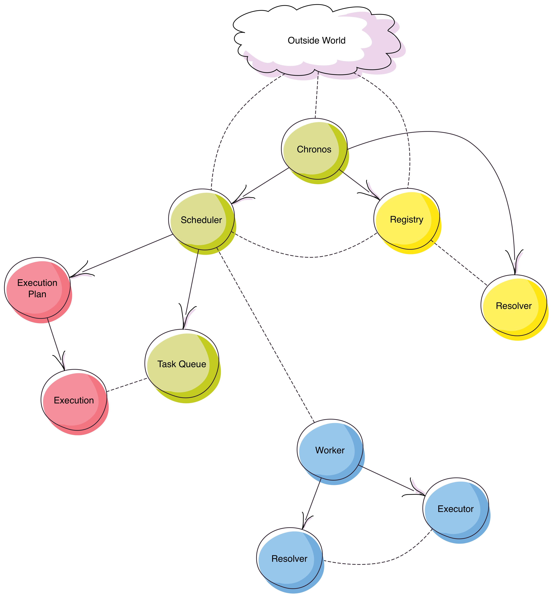
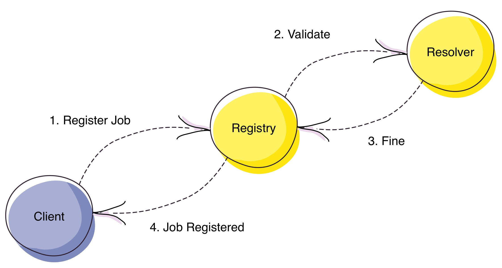

# Chronos

Chronos is a fault-tolerant distributed task scheduler platform that runs on the JVM. The aim of the project is
the implementation of a reliable system able to run large amount of scheduled tasks without single points of failure.

To achieve that, Chronos is composed of a cluster of scheduler nodes and ad hoc worker nodes that connect to this
cluster and request for work to be sent to them. It's basically a generalization of the [distributed worker
pattern](http://letitcrash.com/post/29044669086/balancing-workload-across-nodes-with-akka-2) (and in fact the
implementation owes a lot to the previous post).

## Terminology

These are the most common terms used across the documentation to describe the platform.

* **JobSpec**: A *JobSpec* is the meta definition of a runnable job. It contains information about the implementation 
 of the job, the artifact in that contains that implementation and the parameters it accepts (among other things).
* **ExecutionPlan**: An *ExecutionPlan* is the main controller of runnable jobs. It is in charge of creating new
 execution instances and to trigger them at the appropriate moment in time.
* **Execution**: An *Execution* is an instance of a runnable job. These are managed internally inside Chronos
 although client applications can access the data they hold in order to get information of the different state
 changes of a given execution or what was the execution outcome (if finished).
* **Registry**: It's a sort of repository in which all the available *JobSpecs* are kept.
* **Scheduler**: The main core component of the platform, in charge of scheduling executions, triggering them and
 send them to the worker instances.
* **Worker**: Ad-hoc node, not member of the scheduling cluster, that performs the actual execution of the job
 that was scheduled in the first place.
 
## Topology

## How does it work?

### Registering Jobs

### Scheduling Jobs

